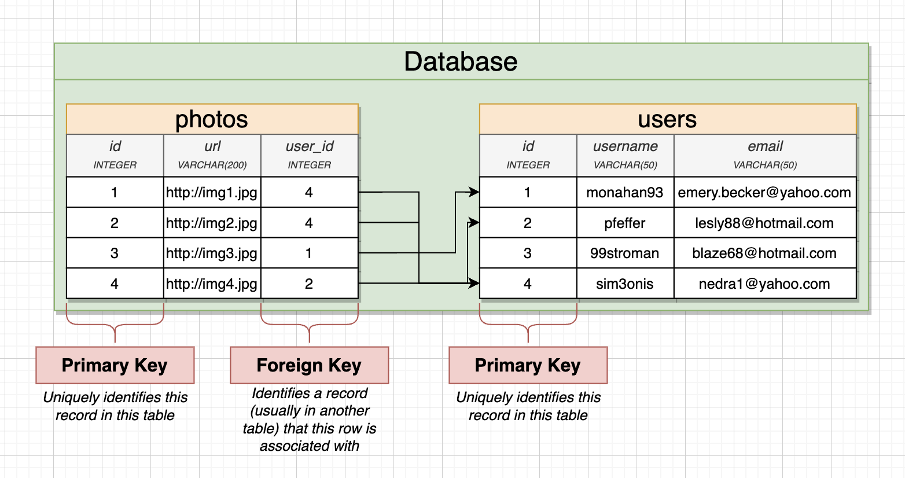
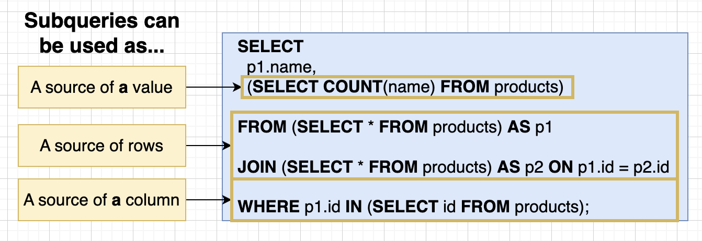
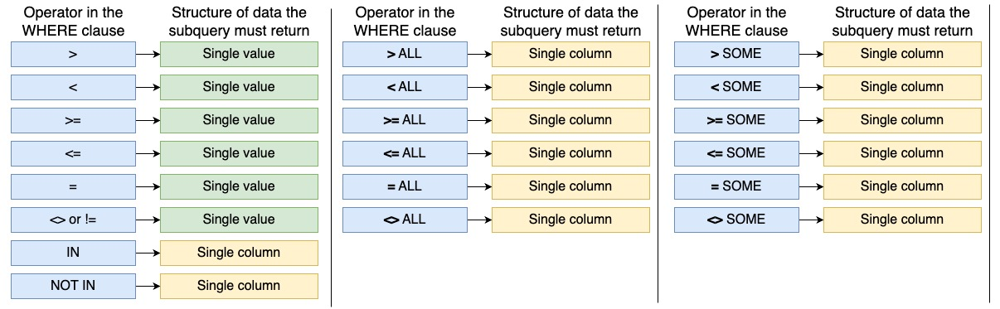
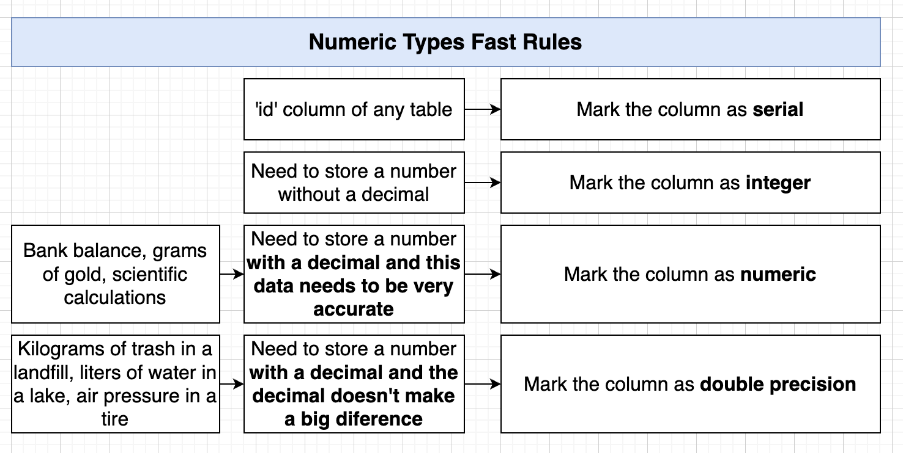
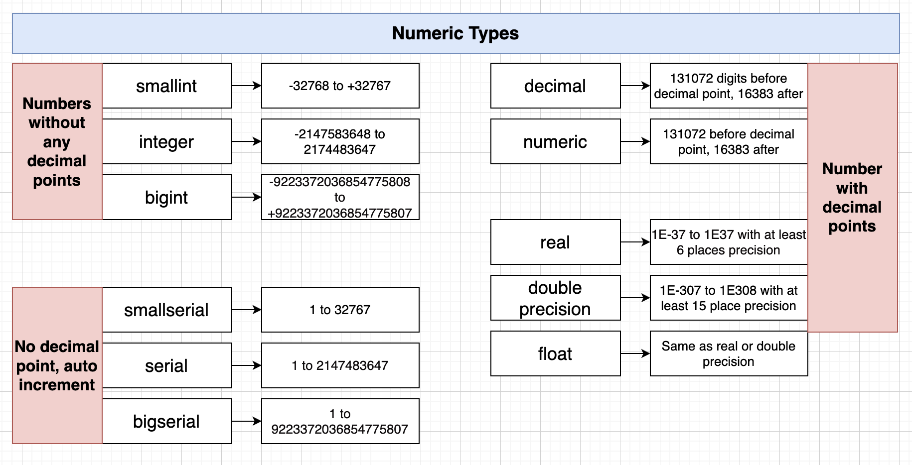
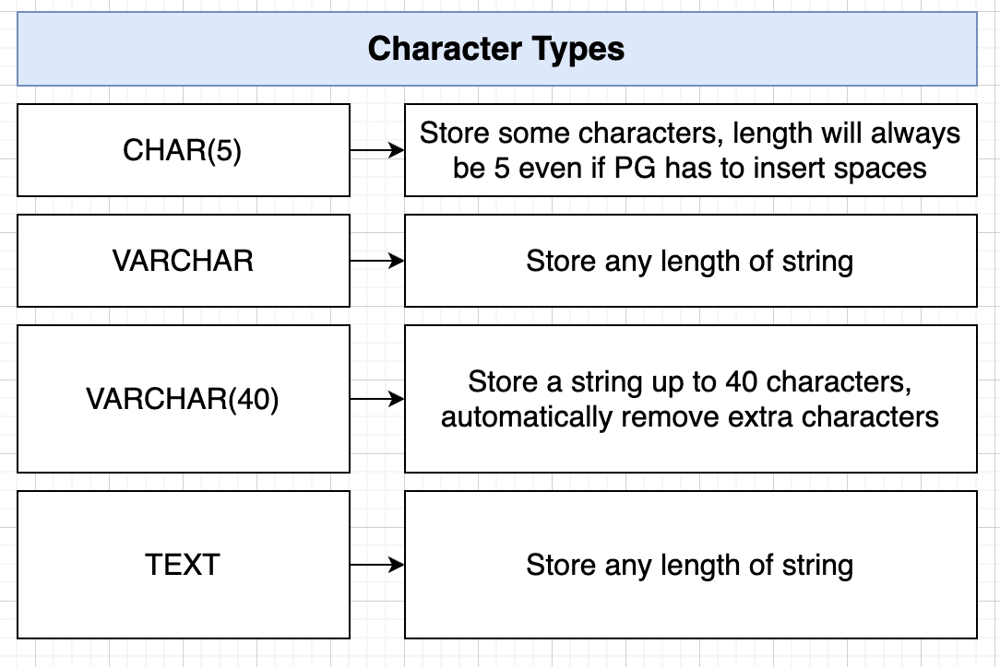
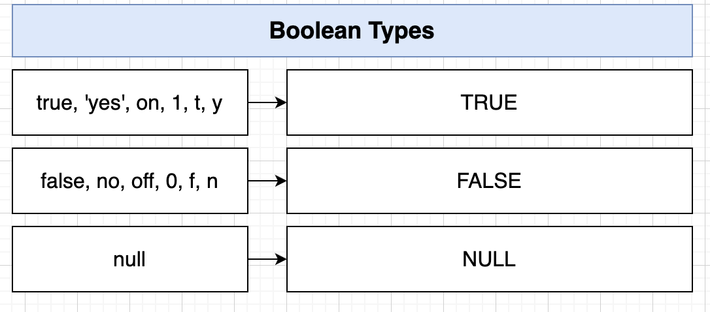
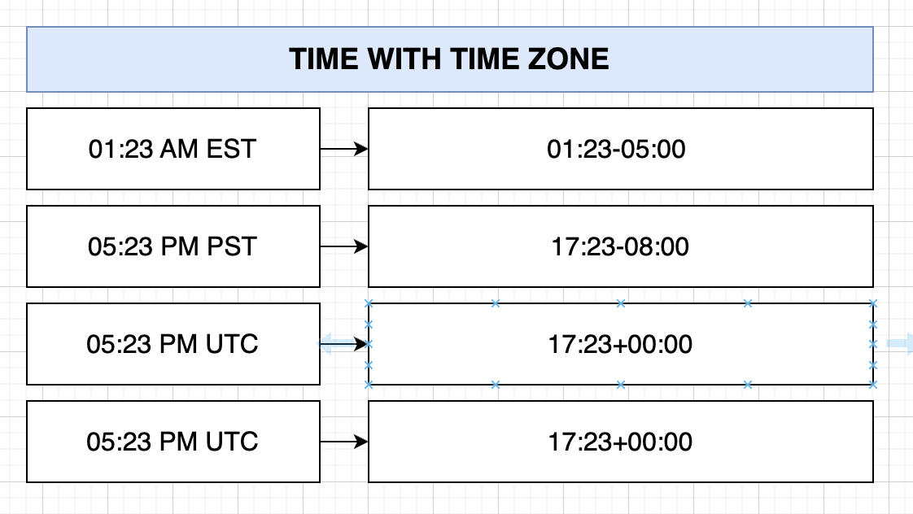
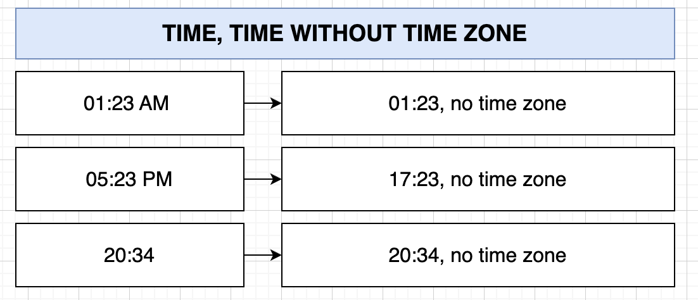
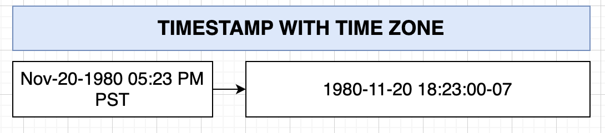

# SQL and PostgreSQL

### SQL

SQL is a standard language for accessing and manipulating databases.

- SQL stands for Structured Query Language
- SQL lets you access and manipulate databases
- SQL became a standard of the American National Standards Institute (ANSI) in 1986, and of the International Organization for Standardization (ISO) in 1987

**SQL Playground**: https://pg-sql.com/

### Basic Query

### Creating Table

```sql
CREATE TABLE cities (
    name VARCHAR(50),
    country VARCHAR(50),
    population INTEGER,
    area INTEGER
);
```

`CREATE TABLE` are keyword tell the databse that we want to do something. Always written out in capital letters.

And `cities` are identifier tell the database what thing we want to action on. ALways writter out in lower case letter.

`name`, `country`, `population` and `area` are column at the `cities` table.

`VARCHAR(50)` means a variable length character with a maximum of 50 chars.

### Inserting Table

```sql
INSERT INTO cities (name, country, populaiton, area)
VALUES ('Tokyo', 'Japan', 38505000, 8223);
```

or use multiple insert rows

```sql
INSERT INTO cities (name, country, population, area)
VALUES ('Tokyo', 'Japan', 38505000, 8223),
        ('Delhi', 'India', 28125000, 2240),
        ('Sanghai', 'China', 22125000, 4015),
        ('Sao Paulo', 'Brazil', 20935000, 3043);
```

### Retrive Values of Table

Manual select column

```sql
SELECT name, country, population, area FROM cities;
```

Select column as needed

```sql
SELECT name, area FROM cities;
```

Or to retrieve all field use `*`

```sql
SELECT * FROM cities;
```

### Calculating Column

A generated column/calculating column is a special column that is always computed from other columns. Thus, it is for columns what a view is for tables. There are two kinds of generated columns: stored and virtual. A stored generated column is computed when it is written (inserted or updated) and occupies storage as if it were a normal column. A virtual generated column occupies no storage and is computed when it is read. Thus, a virtual generated column is similar to a view and a stored generated column is similar to a materialized view (except that it is always updated automatically). PostgreSQL currently implements only stored generated columns.

```sql
SELECT name, (population - area) AS calculated FROM cities;
```

In calculating column, SQL can run math operators

| Code  |  Name |
|---|---|
| `+`  |  Add |
| `-`  |  Subtract |
| `*`  |  Multiply |
| `/`  |  Divide |
| `^`  |  Exponent |
| `|/` |  Square Root |
| `@`  |  Absolute Value |
| `%`  |  Remainder |

### String Operator

| Code  |  Name |
|---|---|
| `||`  |  Join two strings |
| `CONCAT()`  |  Join two string |
| `LOWER()`  |  Give a lower case string |
| `LENGTH()`  |  Gives number of characters in a string |
| `UPPER()`  |  Gives an upper case string |

More info about string function and operator: https://www.postgresql.org/docs/9.1/functions-string.html

Example:

```sql
SELECT name || ', ' || country AS location FROM cities;
```

```sql
SELECT CONCAT(name, ', ', country) AS location FROM cities;
```

## Query

### Filter `Where`

```sql
SELECT select_list
FROM table_name
WHERE condition
ORDER BY sort_expression
```

The `WHERE` clause appears right after the FROM clause of the `SELECT` statement.  The `WHERE` clause uses the `condition` to filter the rows returned from the `SELECT` clause.

Example:

```sql
SELECT * FROM cities WHERE area > 8224;
```

Comparison Math Operator at `WHERE`

| Code  |  Name |
|---|---|
| `=`  |  Are the values equals? |
| `>`  |  Is the value on the left greater? |
| `<`  |  Is the value on the left less? |
| `>=`  |  Is the value on the left greater or equal to? |
| `IN`  |  Is the value present in a list? |
| `<=`  |  Is the value on the left lesser or equal to? |
| `<>`  |  Are the values not equal? |
| `!=`  |  Are the values not equal? |
| `BETWEEN`  |  Is the value between two other values? |
| `NOT IN`  |  Is the value not persent in a list? |

```sql
SELECT * FROM cities WHERE area BETWEEN 2000 AND 5000;
SELECT * FROM cities WHERE name IN ('Delhi', 'Shanghai');
SELECT * FROM cities WHERE name NOT IN ('Delhi', 'Shanghai');
SELECT * FROM cities WHERE area IN (2000, 5000) 
                                AND name = 'Delhi';
```

### Update

```sql
UPDATE table_name
SET column1 = value1,
    column2 = value2,
    ...
WHERE condition;
```

In this syntax:

- First, specify the name of the table that you want to update data after the UPDATE keyword.
- Second, specify columns and their new values after SET keyword. The columns that do not appear in the SET clause retain their original values.
- Third, determine which rows to update in the condition of the WHERE clause.

### Delete

```sql
DELETE FROM table_name
WHERE condition;
```
In this syntax:

- First, specify the name of the table from which you want to delete data after the DELETE FROM keywords.
- Second, use a condition in the WHERE clause to specify which rows from the table to delete

Example:

```sql
DELETE FROM cities
WHERE name = 'Tokyo';
```

### Table

Tables are database objects that contain all the data in a database. In tables, data is logically organized in a row-and-column format similar to a spreadsheet. Each row represents a unique record, and each column represents a field in the record. For example, a table that contains employee data for a company might contain a row for each employee and columns representing employee information such as employee number, name, address, job title, and home telephone number.

### What Tables Should we make?

- Common features (like authentication, comments, etc) are frequently build with conventional table names and columns
- What type of resources exist in your app? Create a separate table for each of these features
- Features that seem to indicate a relationshop or ownership between two types of resources need to be reflected in our table design

### One to many

A one-to-many relationship occurs when one record in table 1 is related to one or more records in table 2. However, one record in table 2 cannot be related to more than one record in table 1.

### Many to one

Many-to-One relationship in DBMS is a relationship between more than one instances of an entity with one instance of another entity.

### One to one

A one-to-one relationship in a database occurs when each row in table 1 has only one related row in table 2.

### Many to Many

A many-to-many relationship occurs when multiple records in one table are related to multiple records in another table.

### Primary Key and Foreign Key

**Primary Key**: A primary key is used to ensure that data in the specific column is unique. A column cannot have NULL values. It is either an existing table column or a column that is specifically generated by the database according to a defined sequence. 

**Foreign Key**: A foreign key is a column or group of columns in a relational database table that provides a link between data in two tables. It is a column (or columns) that references a column (most often the primary key) of another table. 

| Primary Key  |  Foreign Key |
|---|---|
| A primary key is used to ensure data in the specific column is unique.  |  A foreign key is a column or group of columns in a relational database table that provides a link between data in two tables. |
| It uniquely identifies a record in the relational database table.  |  It refers to the field in a table which is the primary key of another table. |
| Only one primary key is allowed in a table.  |  Whereas more than one foreign key are allowed in a table. |
| It is a combination of UNIQUE and Not Null constraints.  |  It can contain duplicate values and a table in a relational database. |
| It does not allow NULL values.  |  It can also contain NULL values. |
| Its value cannot be deleted from the parent table. |  Its value can be deleted from the child table. |
| It constraint can be implicitly defined on the temporary tables.  |  It constraint cannot be defined on the local or global temporary tables. |



Example Primary Key:

```sql
CREATE TABLE users (
  id SERIAL PRIMARY KEY,
  username VARCHAR(50)
 );
```

Note: `SERIAL PRIMARY KEY` meant is that id will automatically generate increments

Example Foreign Key:

```sql
CREATE TABLE photos (
  id SERIAL PRIMARY KEY,
  url VARCHAR(200),
  user_id INTEGER REFERENCES users(id)
 );
```

Note: To create a foreign key, use the `REFERENCES` keyword, with the format `REFERENCES TABLE_NAME(COLUMN_PRIMARY_KEY)`

Query by foreign key with JOIN:

```sql
SELECT * FROM photos 
JOIN users on users.id = photos.user_id;
```

### Constraints Around Deleting

| Delete Option  |  What happen |
|---|---|
| `ON DELETE RESTRICT` | Throw an error |
| `ON DELETE NO ACTION` | Throw an error |
| `ON DELETE CASCADE` | Delete the relation too! |
| `ON DELETE SET NULL` | Set the reference of table to `NULL` |
| `ON DELETE SET DEFAULT` | Set the value to default value, if one provided |

### Relating Record with Join

**JOIN**:

- Procuces values by merging together rows from different related tables
- Use a join most times you'r asked to find data that involves multiple resources

**Aggregation**: 

- Looks at many rows and calculated a single values
- Words like `most` , `average`, `least` are a sing that you need to use an aggregation

### Join Data from Different Table

```sql
SELECT contents, username
FROM comments
JOIN users ON users.id = comments.user_id;
```

Notes:

- Table order `FROM` and `JOIN` frequently makes a difference.
- We must give context if column names colide
- Tables can be renamed using the `AS` keyword
- There are a few kinds of joins!

### Alternate Form Syntax

```sql
SELECT comments.id AS comment_id, p.id
FROM photos AS p
JOIN comments ON p.id = comments.photo_id;
```

### 4 Kinds of JOIN

1. **INNER JOIN** => The INNER JOIN keyword selects all rows from both the tables as long as the condition is satisfied. This keyword will create the result-set by combining all rows from both the tables where the condition satisfies i.e value of the common field will be the same. 

  

  ```sql
  SELECT url, username
  FROM photos
  JOIN users ON users.id = photos.user_id;
  ```

2. **LEFT JOIN** => This join returns all the rows of the table on the left side of the join and matches rows for the table on the right side of the join. For the rows for which there is no matching row on the right side, the result-set will contain null. LEFT JOIN is also known as LEFT OUTER JOIN.

  

  ```sql
  SELECT url, username
  FROM photos
  LEFT JOIN users ON users.id = photos.user_id;
  ```

3. **RIGH JOIN** => RIGHT JOIN is similar to LEFT JOIN. This join returns all the rows of the table on the right side of the join and matching rows for the table on the left side of the join. For the rows for which there is no matching row on the left side, the result-set will contain null. RIGHT JOIN is also known as RIGHT OUTER JOIN. 

  

  ```sql
  SELECT url, username
  FROM photos
  RIGHT JOIN users ON users.id = photos.user_id;
  ```

4. **FULL JOIN** => FULL JOIN creates the result-set by combining results of both LEFT JOIN and RIGHT JOIN. The result-set will contain all the rows from both tables. For the rows for which there is no matching, the result-set will contain NULL values.

  

  ```sql
  SELECT url, username
  FROM photos
  FULL JOIN users ON users.id = photos.user_id;
  ```

### Aggregating and Grouping

**Grouping**:

- Reduce many rows down to fewer rows
- Done by using the `GROUP BY` keyword
- Visualizing the result is key to use

```sql
SELECT user_id
FROM comments
GROUP BY user_id;
```

**Aggregates**:

- Reduces many values down to one
- Done by using `aggregate functions`

| Function  |  Description |
|---|---|
| `COUNT()` | Return the number of values in a group values |
| `SUM()` | Find the **sum** of a group of numbers |
| `AVG()` | Find the **average** of a group of numbers |
| `MIN()` | Return the **minimum** value from a group of numbers |
| `MAX()` | Return the **maximum** value from a group of numbers |

```sql
SELECT SUM(id)
FROM comments;

SELECT AVG(id)
FROM comments;
```

**Combining Group By and Aggregate**

```sql
SELECT user_id, MAX(id)
FROM comments
GROUP BY user_id;

SELECT user_id, COUNT(id) AS num_comments_created
FROM comments
GROUP BY user_id;
```

### Filtering Group with Having

This is the keyword used in the filter using `HAVING`:

| Keyword  |  Description |
|---|---|
| `FROM` | Specifies starting set of rows to work with |
| `JOIN` | Merges in data from additional tables |
| `WHERE` | Filters the set of rows |
| `GROUP BY` | Groups rows by a unique set of values |
| `HAVING` | Filters the set of groups |


Example:

```sql
SELECT photo_id, COUNT(*)
FROM comments
WHERE photo_id < 3
GROUP BY photo_id
HAVING COUNT(*) > 2;
```

### Sorting

ASC

```sql
SELECT *
FROM products
ORDER BY name ASC;
```

DESC

```sql
SELECT *
FROM products
ORDER BY name DESC;
 
-- ....

SELECT *
FROM products
ORDER BY price, weight DESC;
```

### Offset and Limit

`OFFSET` => Skip the first rows of the result set
`LIMIT` => Only give the first rows of the result set

Example:

```sql
SELECT *
FROM users
OFFSET 40;

-- ....

SELECT *
FROM users
LIMIT 5;
```

### UNION

The `UNION` operator combines result sets of two or more SELECT statements into a single result set.

| Keyword  |  Description |
|---|---|
| `UNION` | Join togetger the results of two queries and remove duplicate rows |
| `UNION ALL` | Join together results of two queries |
| `INTERSECT` | Find the rows common in the results of two queries. Remove duplicates |
| `INTERSECT ALL` | Find the rows common in the result of two queries |
| `EXCEPT` | Find the rows that are present in first query but not second query. Remove duplicates |
| `EXCEPT ALL` | Find the rows that are present in first query but not second query. |

Example:

```sql
-- EXCEPT
(
  SELECT *
  FROM products
  ORDER BY price DESC
  LIMIT 4
)
EXCEPT
(
  SELECT *
  FROM products
  ORDER BY price / weight DESC
  LIMIT 4
)l
```

## Sub-Query



A **subquery** is a query nested inside another query such as SELECT, INSERT, DELETE and UPDATE. In this tutorial, we are focusing on the SELECT statement only.

Example

```sql
SELECT name, price
FROM producs
WHERE price > (
  SELECT MAX(price) FROM products WHERE department = 'Toys'
);

-- 
SELECT name, price, (
  SELECT price FROM products WHERE id = 3
) AS id_3_price
FROM products
WHERE price > 867;

-- Subquery in JOIN
SELECT first_name
FROM users
JOIN (
  SELECT user_id FROM orders WHERE product_id = 3
) AS o
ON o.user_id = users_id;

-- Subquery IN
-- With `IN` keyword structure of data allowed to be returned by subquery changes depending on the comparison operator
SELECT id
FROM orders
WHERE product_id IN (
  SELECT id FROM products WHERE price / weight > 50
);
```

## Data Structure Where Subquery




`SOME` operator used to compare a scalar value with a set of values returned by a subquery

```sql
SELECT name, department, price
FROM products
WHERE price > SOME (
  SELECT price
  FROM products
  WHERE department = 'Industrial'
);
```

## Select Distinct

`DISTINCT` clause is used in the `SELECT` statement to remove duplicate rows from a result set. The `DISTINCT` clause keeps one row for each group of duplicates. The `DISTINCT`clause can be applied to one or more columns in the select list of the `SELECT` statement.

Example:

```sql
SELECT DISTINCT department
FROM products;

-- .....
SELECT DISTINCT department, name
FROM products;
```

## Utility Keywords

```sql
-- GREATEST 
-- Return greatest value from a list
SELECT GREATEST(20, 10, 30);

SELECT name, weight, GREATEST(30, 2 * weight)
FROM products;

-- LEAST
-- Return the smallest value from a list of any number of expression
SELECT LEAST(10, 20, 50, 100);

SELECT name, price, LEAST(price * 0.5, 400)
FROM products;

-- CASE
-- Expression in case is the same as IF/ELSE statement in other programming languages

SELECT 
  name, 
  price,
  CASE
    WHEN price > 600 THEN 'high'
    WHEN price > 300 THEN 'medium'
    ELSE 'cheap'
  END
FROM products;
```

## Data Types

### Numeric




### Caracter



### Boolean



### Times, Dates and Timestamp






## Validation

### Null Constraints

To create a null constraint, when creating a table column, the `NOT NULL` property is given.

Example:

```sql
CREATE TABLE products (
	id SERIAL PRIMARY KEY,
	name VARCHAR(50),
	department VARCHAR(50),
	price INTEGER NOT NULL,
	weight INTEGER
)
```

And when the table was previously created, you can update the column with alter

Example:

```sql
ALTER TABLE products
ALTER COLUMN price
SET NOT NULL;
```

After setting the null constraint, if there is old data that is still null, it is necessary to migrate/update the old data to provide a fallback value:

Example:

```sql
UPDATE products
SET price = 0
WHERE price IS NULL;
```

### Default Values

A column can be assigned a default value. When a new row is created and no values are specified for some of the columns, those columns will be filled with their respective default values. A data manipulation command can also request explicitly that a column be set to its default value, without having to know what that value is.

If no default value is declared explicitly, the default value is the null value. This usually makes sense because a null value can be considered to represent unknown data.

```sql
CREATE TABLE products (
	id SERIAL PRIMARY KEY,
	name VARCHAR(50),
	department VARCHAR(50),
	price INTEGER DEFAULT 9999,
	weight INTEGER
)
```

OR

```sql
ALTER TABLE products
ALTER COLUMN price
SET DEFAULT 999;
```

### Unique Constraints

When a UNIQUE constraint is in place, every time you insert a new row, it checks if the value is already in the table. It rejects the change and issues an error if the value already exists. The same process is carried out for updating existing data.

```sql
CREATE TABLE products (
	id SERIAL PRIMARY KEY,
	name VARCHAR(50) UNIQUE,
	department VARCHAR(50),
	price INTEGER,
	weight INTEGER
)
```

OR

```sql
ALTER TABLE products
ADD UNIQUE (name);
```

### Delete Constraints

To see the constraints name go to pg admin `DB -> Schemas -> Tables -> [Your Table] -> Constraints`

```sql
ALTER TABLE products
DROP CONSTRAINT products_name_key;
```

### Validation Check

A `CHECK` constraint is a kind of constraint that allows you to specify if values in a column must meet a specific requirement.

```sql
CREATE TABLE products (
	id SERIAL PRIMARY KEY,
	name VARCHAR(50),
	department VARCHAR(50),
	price INTEGER CHECK (price > 0),
	weight INTEGER
)

-- OR
CREATE TABLE orders (
	id SERIAL PRIMARY KEY,
	name VARCHAR(40) NOT NULL,
	created_at TIMESTAMP NOT NULL,
	est_delivery TIMESTAMP NOT NULL,
	CHECK (created_at < est_delivery)
)
```

OR

```sql
ALTER TABLE products
ADD CHECK (price > 0);
```

## DB Structure Design Pattern

### SQL Schema Designer

1. dbdiagram.io
1. drawsql.app
1. sqldbm.com
1. quickdatabasediagrams.com
1. ondras.zarovi.cz/sql/demo

---
146

## References

- https://www.udemy.com/course/sql-and-postgresql
- https://www.w3schools.com/sql/sql_intro.asp
- https://pg-sql.com/
- https://www.postgresql.org/docs/current/ddl-generated-columns.html
- https://www.postgresql.org/docs/9.1/functions-string.html
- https://www.postgresqltutorial.com/postgresql-tutorial/postgresql-where/
- https://learn.microsoft.com/en-us/sql/relational-databases/tables/tables?view=sql-server-ver16
- https://www.geeksforgeeks.org/difference-between-primary-key-and-foreign-key/
- https://www.geeksforgeeks.org/sql-join-set-1-inner-left-right-and-full-joins/
- https://www.geeksforgeeks.org/postgresql-some-operator/
