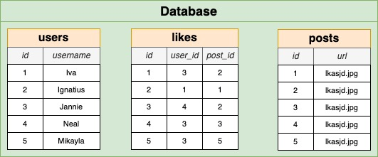
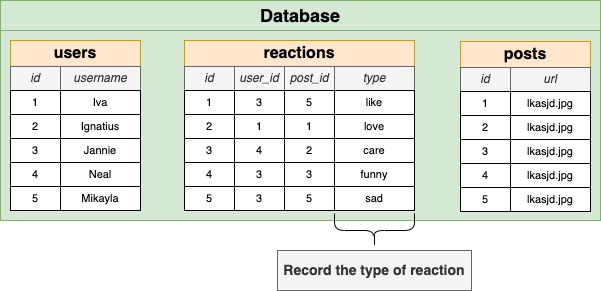
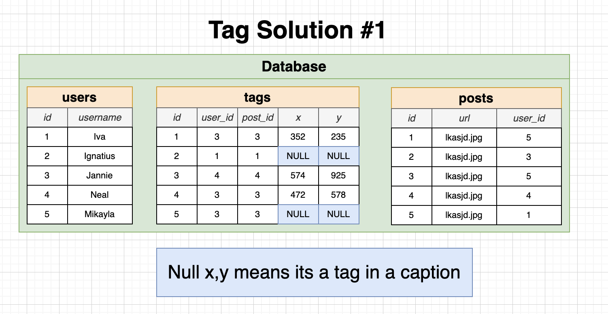
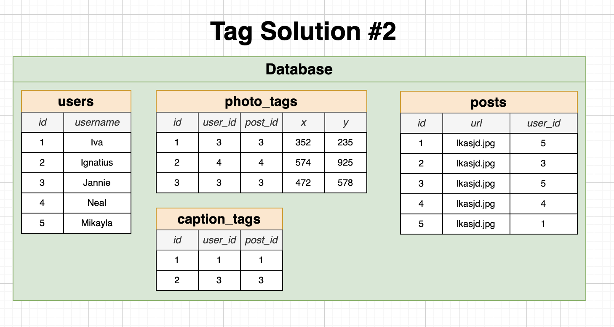
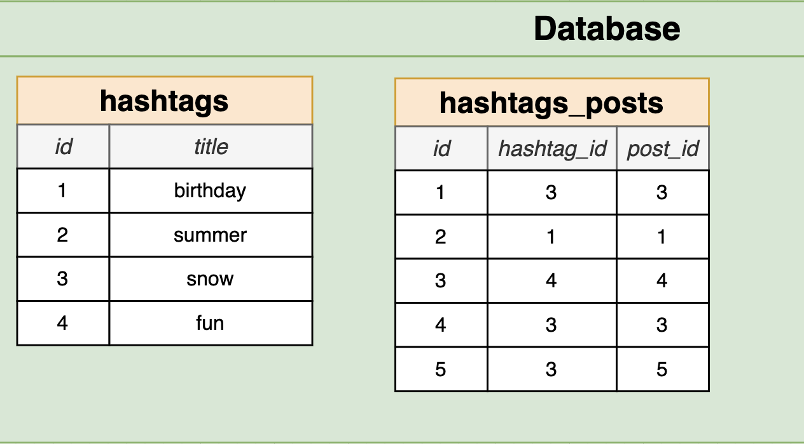

**DB Design**

**Like**



**Like with Reaction**



> Add a unique constraint with `UNIQUE`(user_id, post_id) in `likes` table

**Like Event**: Insert row in `likes` table where `user_id` & `post_id` must be same
**Unlink Event**: Delete row in `likes` table where `user_id` & `post_id` must be same

Example querys:

Get total like of post

```sql
SELECT COUNT(*)
FROM likes
WHERE post_id = 3
```

Get Post Id's of top five most liked posts

```sql
SELECT posts.id
FROM posts
JOIN likes.post_id = posts.id
GROUP BY posts.id
ORDER BY count(*) DESC
LIMIT 5
```

Get username of pople who like the post with id = 3

```sql
SELECT username
FROM likes
JOIN users ON users.id = likes.user_id
WHERE post_id = 3;
```

**Mention/Tags**

To create a tag/mention table design, there are two solutions approach:




**HashTags**


